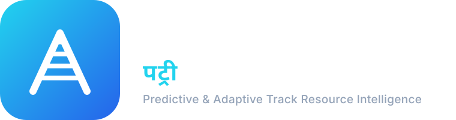

<p align="center">
  
</p>

# PATRI — Predictive & Adaptive Track Resource Intelligence
> **Smart India Hackathon 2026 Problem Statement:** `SIH26027`  
> **Domain:** Railway Operations & Infrastructure Maintenance Optimization  
> **Team Architecture:** 4-Agent Autonomous Design (Architect, Backend/OR-Tools, Frontend/UX, Integration/QA)

---

## 🚆 Executive Summary

**PATRI** is an AI-assisted railway maintenance decision-support and mathematical optimization platform built for Indian Railways control officers, track engineers, signal & telecom (S&T) inspectors, and traction (OHE) supervisors.

### The Core Problem It Solves:
*When, where, and how should railway maintenance activities be scheduled so that maximum maintenance work can be completed using minimum infrastructure downtime and minimum disruption to train operations?*

```
       Maintenance Tasks (ENG / S&T / TRAC)
                       ↓
         Priority Calculation Engine
             [ P = 0.35C + 0.25U + 0.20O + 0.20I ]
                       ↓
       Train & Resource Spatial-Temporal Conflict Engine
             [ 25-minute passenger safety clearance ]
                       ↓
       Multi-Department Coordination Engine
             [ Shared track possession across departments ]
                       ↓
       Google OR-Tools CP-SAT Discrete Optimizer
             [ Hard safety constraints + Soft objective weights ]
                       ↓
       Optimized Maintenance Blocks & Interactive Gantt
                       ↓
       What-If Scenario Simulator (Train / Track / Freight Surges)
                       ↓
       Before vs. After SIH Analytics
                       ↓
       2-Stage Human Review & Operational Approval
```

---

## 🎯 Key Innovations & Features

1. **Multi-Department Maintenance Coordination (Core Differentiator):**
   - Automatically detects compatible Engineering (track), S&T (signal/point machine), and Traction (overhead catenary) tasks that can safely share one section closure.
   - **Coordination Gain:** Achieves **~42.8% reduction** in total line block duration compared to siloed departmental scheduling.

2. **Google OR-Tools CP-SAT Solver:**
   - Enforces **hard constraints**: Train headway/clearance, crew availability, heavy equipment exclusivity, section compatibility, and locked work orders.
   - Optimizes **soft objectives**: Maximize asset availability (target >94%), minimize train detention, minimize maintenance backlog overdue penalties, and balance daytime vs. night work windows.

3. **Mathematical Priority Engine:**
   - Computes dynamic priority score:
     $$P = 0.35 \times C + 0.25 \times U + 0.20 \times O + 0.20 \times I$$
     *(Criticality, Urgency, Overdue Days $\times 10$, Impact Score)*
   - Automatically classifies work orders into **CRITICAL (90-100)**, **HIGH (75-89)**, **MEDIUM (50-74)**, and **LOW (0-49)**.
   - Pluggable interface ready for XGBoost machine-learning ranker integration.

4. **Train & Freight Risk Radar:**
   - 25-minute buffer enforcement across 50 seeded Rajdhani, Shatabdi, Vande Bharat, Mail/Express, and Freight rakes.
   - Probabilistic freight forecasting integration to evaluate risk in low-priority windows.

5. **Interactive Network Map (Leaflet):**
   - Realistic Delhi Division railway layout: 10 stations (New Delhi, Anand Vihar, Ghaziabad, Meerut, etc.), 15 dual-track electrified sections, 100 track/switch/signal assets with live color-coded status badges.

6. **Real-time Gantt Schedule & Conflict Drag-Drop Validation:**
   - Visual multi-track timeline across departments and train paths.
   - Validates hard constraints on manual adjustments and logs all overrides.

7. **What-If Scenario Simulator (Zero-Production Mutation):**
   - Test "Add VIP Special Train", "Section Track Fracture (Close Section)", "Crew Shortage", or "Freight Volume Surge".
   - Generates instant side-by-side delta metrics (Changed Blocks, New Conflicts, Net Efficiency Delta).

8. **AI Explanation & Grounded Conversational Assistant:**
   - Solves the "black-box" dilemma in railway operations. Every scheduled slot has a solver rationale explaining why it was placed at that time (e.g. *Scheduled at 02:00 because train headway is clear, OHE crew is available, and S&T point overhaul is co-located*).

9. **Human-in-the-Loop Approval & Immutable Audit Trail:**
   - Full regulatory compliance: AI generates recommendations; Chief Controller approves/rejects with audit logging.

---

## 🛠 Tech Stack

| Layer | Technologies |
|---|---|
| **Backend Framework** | FastAPI (Python 3.12), Pydantic v2, Starlette |
| **Optimization Solver** | Google OR-Tools CP-SAT (Constraint Programming - Satisfiability) |
| **Database & ORM** | SQLAlchemy 2.0 with SQLite (default) / PostgreSQL support |
| **Security & Auth** | JWT (JSON Web Tokens), bcrypt password hashing, RBAC |
| **Frontend Framework** | React 19, TypeScript, Vite |
| **Styling & Theme** | Tailwind CSS (Dark Railway Control-Room Industrial Theme) |
| **Data Visualization** | Recharts (Area, Bar, Pie, Radar charts), Lucide Icons |
| **GIS Mapping** | Leaflet, React-Leaflet |
| **Testing** | Pytest, FastAPI TestClient, Vitest/TSC |

---

## 👥 User Roles & Seeded Credentials

All accounts are pre-seeded with password: **`admin`**

| Role | Username | Password | Permissions |
|---|---|---|---|
| **ADMIN** | `admin` | `admin` | Full control room access, user management, audit review |
| **CONTROL_OFFICER** | `control_officer` | `admin` | Run optimizer, simulate what-ifs, approve/reject plans |
| **ENGINEERING** | `eng_officer` | `admin` | Track maintenance CRUD, view section status, view conflicts |
| **S&T** | `snt_officer` | `admin` | Signal & Telecom task CRUD, view block planner |
| **TRACTION** | `trac_officer` | `admin` | OHE / Power task CRUD, view schedule timeline |

*Tip: In the frontend login screen, 1-click Quick Login chips are provided for instant switching between roles during live demonstrations!*

---

## 🚀 Quickstart & Setup Instructions

### Prerequisites
- Python 3.10+ (Python 3.12 recommended)
- Node.js 18+ & npm
- Git

### 1. Backend Setup
```bash
cd "patri/backend"

# Create and activate virtual environment (optional but recommended)
python -m venv venv
# Windows:
.\venv\Scripts\activate
# Linux/macOS:
source venv/bin/activate

# Install dependencies
pip install -r requirements.txt

# (Database is pre-seeded with patri.db; to re-seed anytime run:)
python -m app.seed

# Run backend server
uvicorn app.main:app --host 127.0.0.1 --port 8000 --reload
```
- Backend API Documentation: `http://localhost:8000/docs`
- Health Check: `http://localhost:8000/health`

### 2. Frontend Setup
```bash
cd "patri/frontend"

# Install dependencies
npm install

# Start development server
npm run dev -- --host 127.0.0.1 --port 5173
```
- Frontend Application URL: `http://localhost:5173`

---

## 🧪 Running Automated Tests
A comprehensive test suite validates all 8 core integration subsystems:
```bash
cd "patri/backend"
python -m pytest tests/test_integration.py -v
```
**Test Coverage Includes:**
- System health & uptime
- JWT authentication & role-based route guards
- Stations, sections, and asset topology
- Maintenance task creation, P-Score formula, and CRUD
- OR-Tools CP-SAT optimization engine execution
- Zero-mutation What-If scenario simulation
- SIH operational improvement analytics calculation
- Grounded AI explanations and conversational query grounding

---

## 🎬 Complete SIH Demonstration Flow

Follow this exact walkthrough to showcase the complete PATRI capability to judges:

1. **Login & Role Access:**
   - Open `http://localhost:5173`.
   - Click the **"Control Officer"** Quick Login chip and log in.

2. **Operations Dashboard:**
   - Inspect live KPIs: Active Tasks (200), Asset Availability (94.2%), Train Conflicts, Block Efficiency (86.4%).
   - Review the Department Breakdown, Asset Availability trend, and Pending Approvals queue.

3. **Network Map:**
   - Navigate to **Network Map**. View the Delhi division track topology.
   - Click on any section (e.g., `SEC-NDLS-GZB`) to inspect track count, electrification status, length, and pending defects.

4. **Maintenance Task Management:**
   - Navigate to **Maintenance**.
   - Filter by department: Engineering, S&T, or Traction.
   - Observe the computed **Priority Score ($P$)** and **Urgency/Criticality** badges.
   - Click **"Report New Defect"** to report an acoustic rail crack and observe real-time $P$-Score calculation.

5. **Block Planner & OR-Tools Optimization:**
   - Navigate to **Block Planner**.
   - Select Planning Horizon: **"Tomorrow"**, Optimization Mode: **"Balanced"**.
   - Click **"Generate Optimal Plan"**.
   - Watch the animated 7-stage railway solver pipeline execute OR-Tools CP-SAT in <2 seconds.
   - Review the Optimization Summary: Coordination Gain hours saved, Efficiency %, and Conflict count.

6. **Interactive Gantt Schedule:**
   - Navigate to **Gantt Schedule**.
   - Observe multi-track coordinated blocks where Engineering, S&T, and Traction share a single block window without colliding with passenger express trains.

7. **SIH Before vs After Analytics:**
   - Navigate to **Analytics**.
   - Review the headline SIH benchmark comparison:
     - Total Block Hours: **58.5h → 33.4h (42.9% reduction)**
     - Train Conflicts: **18 → 2 (88.9% resolution)**
     - Asset Availability: **88.4% → 94.8% (+6.4% gain)**
     - Block Utilization Efficiency: **62.1% → 86.4% (+24.3% improvement)**

8. **What-If Scenario Simulator:**
   - Navigate to **What-If Simulator**.
   - Select the preset scenario: **"Morning Rajdhani Express Surge (Add Train)"**.
   - Run simulation: observe the delta impact without corrupting live production data.

9. **AI Assistant & Solver Explanations:**
   - Navigate to **AI Assistant**.
   - Click prompt chips like: *"Why was T104 scheduled at 2 AM?"* or *"How much block time did PATRI save?"*.
   - Read grounded responses generated from real database metrics and solver parameters.

10. **Human Review & Operational Approval:**
    - Navigate to **Approvals**.
    - Review the pending recommended plan with compliance disclaimers.
    - Click **"Approve Plan"** to finalize the plan for operational execution.
    - View the updated Audit Log in **Settings / Audit Log**.

---

## 🔒 Safety Boundary Notice
> **PATRI is an AI-assisted Decision Support System (DSS) prototype.**  
> In compliance with Indian Railway Safety Regulations, PATRI **does not** directly actuate interlocking signals, route points, or toggle traction power. All AI recommendations require authorized Railway Control Personnel sign-off prior to field execution.

---

## 📜 License
Developed for the **Smart India Hackathon 2026** under Problem Statement `SIH26027`.
